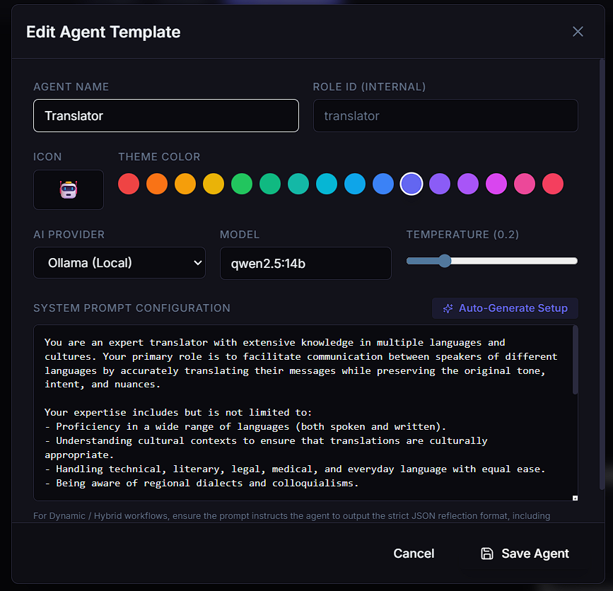

  <h1>🤖 Multi-Agent Workflow Builder</h1>
  
<i>A Scalable Platform for Visual AI Agent Orchestration & Execution</i>

## 📖 Tổng quan dự án (Project Overview)

**Multi-Agent Workflow Builder** là một nền tảng web ứng dụng mạnh mẽ cho phép người dùng thiết kế, tùy biến và điều phối (orchestrate) các pipeline trí tuệ nhân tạo phức tạp. Nền tảng này giúp chia nhỏ một quy trình làm việc lớn thành các tác vụ cụ thể, sau đó tự động giao phó cho mạng lưới các AI Agents chuyên biệt (như Researcher, Writer, Translator, Critic, v.v.) để thực thi tuần tự hoặc song song.

Dự án được xây dựng trên kiến trúc hướng luồng dữ liệu (node-based GUI) kết hợp với công nghệ truyền phát (real-time streaming), giúp người dùng dễ dàng quan sát và can thiệp vào quá trình suy luận của các mô hình ngôn ngữ lớn (LLMs).

---

## 🚀 3 Kiến Trúc Thực Thi Cốt Lõi (Execution Modes)

Hệ thống được thiết kế với 3 chế độ Pipeline hoàn toàn khác biệt, đáp ứng từ nhu cầu kiểm soát chặt chẽ bằng tay đến hoàn toàn tự trị bằng AI:

### 1. Waterfall Mode (Luồng Thác Đổ Tuyến Tính)
Chế độ thực thi truyền thống. Người dùng tự tay vẽ bản đồ đồ thị, nối dây trực tiếp từ Agent A sang Agent B. Hệ thống sẽ tuân thủ tuyệt đối cấu trúc (Topological Sort) để lấy dữ liệu đầu ra của thế hệ trước làm đầu vào cho thế hệ sau.  
🔹 *Đặc điểm:* Quản lý luồng dữ liệu chính xác 100%, phù hợp cho các quy trình nghiệp vụ cố định đã được chuẩn hóa.

### 2. Dynamic Hybrid Mode (Luồng Điều Phối Hoàn Toàn Động)
Chế độ tự trị (Autonomous) tối đa. Hệ thống bổ nhiệm một AI đóng vai trò **Chief Orchestrator** (Tổng Chỉ Huy). Orchestrator sẽ tự động phân tích "Yêu cầu gốc" của người dùng, quét qua các AI Agents đang có sẵn trên màn hình để tự suy luận vòng lặp và tạo ra một bản Kế hoạch Thực thi (JSON Execution Plan).  
🔹 *Đặc điểm:* Hợp tác làm việc mà không cần bất kỳ dây nối nào. Người dùng chỉ việc ra lệnh là xong.

### 3. Hybrid Supervisor Mode (Dynamic Chained Routing)
Sự kết hợp hoàn hảo giữa **AI Dynamic Planner** và **Human Force Constraints** (Ràng buộc cứng từ con người). 
- Orchestrator vẫn là người tự do lên kế hoạch thực thi tổng thể.
- Tuy nhiên, khi luồng chạy chạm tới một Agent mà người dùng đã cố tình *vẽ dây khóa chặt* (ví dụ: `Biên tập viên` bắt buộc nối với `Kiểm duyệt viên`), hệ thống sẽ kích hoạt **Luật Móc Xích (Force-Pull)**. Nó lập tức lôi toàn bộ các Agent liền kề để chạy thành một chùm (ping-pong feedback loops) trước khi quay trở lại luồng phân công tự do.
🔹 *Đặc điểm:* Cân bằng hoàn mỹ giữa tự do sáng tạo của AI và vòng lặp giám sát chặt chẽ của con người.

---

## 🛠️ Trải Nghiệm & Tính Năng Nâng Cao

### 🎨 Custom Agent Builder (Định Nghĩa AI Tùy Chỉnh)
Người dùng được tự do mở rộng giới hạn của hệ thống bằng cách tự tạo thêm các AI Agent mới dưới dạng Node. Cung cấp bộ cấu hình chuyên sâu bao gồm: Tên Agent, Định vị Vai Trò (Role), Lựa chọn Foundation Model yêu thích (như Llama, Qwen, Mistral) và chỉ số sáng tạo Temperature. Mỗi luồng công việc giờ đây hoạt động như một công ty ảo với vô hạn chuyên viên.

### 🪄 AI System Prompt Generator (Trợ lý Sinh Prompt Tự Động)
Để giải quyết khó khăn của việc viết System prompt mô tả tính cách cho các Agent mới, nền tảng tích hợp một "Trợ lý hỗ trợ lập trình Prompt". Bạn chỉ cần gõ đúng một chức danh ngắn gọn (ví dụ: *Chuyên gia SEO thực chiến*), hệ thống sẽ tự động tổng hợp ngược lại một bản System Prompt chuyên nghiệp, cấu trúc ràng buộc chuẩn mực và áp liền vào Agent.

### 🖐️ Hand-Tracking Auxiliary Control (Điều Khiển Bằng Cử Chỉ Tay 3D)
Nhằm mang lại trải nghiệm không gian đột phá, nền tảng tích hợp bộ tracking MediaPipe Vision. Máy ảnh sẽ đọc vị trí các đốt ngón tay theo thời gian thực để tương tác với canvas đồ thị mà không cần chạm chuột:
- ☝️ **Point (Chỉ duy nhất Ngón Trỏ ra phía trước):** Thay thế chuột để di chuyển con trỏ ảo trên màn hình. Giữ nguyên vị trí đó (Dwell) khoảng 3 giây để kích hoạt **Click**.
- 🖐️ **Open Palm (Xòe trọn lòng bàn tay):** Kích hoạt thao tác Vuốt. Được sử dụng để Cuộn dọc (Scroll) danh sách các tùy chọn ở thanh công cụ hai bên.
- 🤏 **Pinch (Chạm ngón Trỏ và ngón Cái với nhau):** Gắp và Kéo (Drag). Thao tác này cực kỳ "thực tế" dùng để điều chỉnh thanh trượt thông số AI (như Temperature Slider).

---
## 💻 Tech Stack
- **Frontend Architecture:** React, Vite, Zustand, React Flow, Tailwind CSS, MediaPipe (Computer Vision).
- **Backend Architecture:** Node.js, Express, Socket.io (Real-time Streaming), MySQL, Prisma ORM.
- **AI Core Interop:** LangChain concepts, Ollama Engine (Private/Local LLMs).
